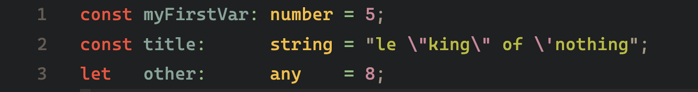

# Square Code

Format your code with nice columns. Square up your stuff!

## Features

Select your text to format and active the `Square Code: Format Selection` command.

Before:

After:

> Tip: You can bind this command to a shortcut, say `ctrl+f q`

## Release Notes

### 0.1.0

Initial release of Square Code.

Features:
-  Format Selection
